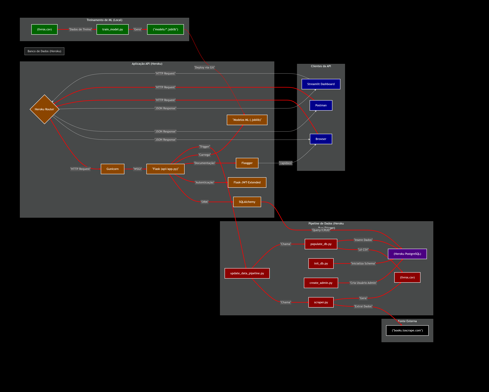

# API Pública para Consulta de Livros (Projeto Tech Challenge)

Este repositório contém o código-fonte de uma API RESTful para consulta de informações sobre livros, extraídas do site "Books to Scrape". O projeto inclui um pipeline de dados completo (web scraping, armazenamento em banco de dados) e uma API com funcionalidades de consulta, estatísticas e integração com um modelo de Machine Learning (clusterização).

**Deploy da API:** A API está disponível publicamente em: `https://turetto-api-livros-3a30130b990d.herokuapp.com/` 

**Documentação Interativa (Swagger):** `https://turetto-api-livros-3a30130b990d.herokuapp.com/apidocs/` 

## Arquitetura do Projeto




* **Fonte de Dados:** Books to Scrape (https://books.toscrape.com/)
* **Web Scraping:** Script Python (`scripts/scraper.py`) usando `requests` e `BeautifulSoup` para extrair dados de todos os livros e categorias.
* **Armazenamento Temporário:** Arquivo `data/livros.csv` gerado pelo scraper (ignorado pelo Git).
* **Banco de Dados:** PostgreSQL (no Heroku, `heroku-postgresql:essential-0`) acessado via SQLAlchemy. Modelos definidos em `api/modelo.py`.
* **API:** Aplicação Flask (`api/app.py`) servida com Gunicorn.
* **Machine Learning:**
    * Treinamento (offline): Script `scripts/train_model.py` usa `pandas` e `scikit-learn` para treinar um modelo K-Means com base em preço e avaliação.
    * Artefatos: O modelo treinado (`kmeans_model.joblib`) e o scaler (`scaler.joblib`) são salvos na pasta `models/`.
    * Inferência (online): A API carrega os artefatos e usa o endpoint `POST /api/v1/ml/predictions` para prever o cluster de novos livros.
* **Documentação:** Gerada automaticamente com `Flasgger` (Swagger UI).
* **Deploy:** Hospedado na plataforma Heroku.

## Funcionalidades da API

A API oferece os seguintes endpoints principais (prefixo `/api/v1`):

* **Livros:**
    * `GET /books`: Lista todos os livros.
    * `GET /books/{id}`: Detalhes de um livro específico.
    * `GET /books/search`: Busca livros por título e/ou categoria.
    * `GET /books/top-rated`: Lista os livros com avaliação 5 estrelas.
    * `GET /books/price-range`: Filtra livros por faixa de preço.
* **Categorias:**
    * `GET /categories`: Lista todas as categorias únicas.
* **Insights:**
    * `GET /stats/overview`: Estatísticas gerais da coleção.
    * `GET /stats/categories`: Estatísticas detalhadas por categoria.
* **Autenticação:**
    * `POST /auth/login`: Autentica um usuário e retorna um token JWT.
* **Admin (Protegido):**
    * `POST /admin/scraping/trigger`: Dispara o pipeline de atualização de dados (requer token de admin).
* **Machine Learning:**
    * `GET /ml/training-data`: Retorna todos os dados brutos para treinamento.
    * `GET /ml/features`: Retorna features processadas para todos os livros.
    * `GET /ml/features/{id}`: Retorna features processadas para um livro específico.
    * `POST /ml/predictions`: Prevê o cluster de um livro (requer preço e avaliação).
* **Health Check:**
    * `GET /health`: Verifica se a API está operacional.

*Para detalhes completos sobre parâmetros e respostas, consulte a [Documentação Interativa (Swagger)](https://turetto-api-livros-3a30130b990d.herokuapp.com/apidocs/).*

## Como Executar o Projeto Localmente

**Pré-requisitos:**

* Python 3.10+ 
* Git
* `psql` (cliente de linha de comando do PostgreSQL, opcional para banco local SQLite)
* Um ambiente virtual (recomendado)

**Instalação:**

1.  Clone o repositório usando o comando `git clone` com a URL do seu repositório GitHub e navegue para a pasta do projeto.
2.  Crie um ambiente virtual com `python -m venv venv` e ative-o (usando `venv\Scripts\activate` no Windows ou `source venv/bin/activate` no macOS/Linux).
3.  Instale todas as dependências necessárias, incluindo as de treinamento, usando o comando `pip install -r requirements.txt`.
4.  Crie a pasta `data/` na raiz do projeto, caso ela ainda não exista.

**Configuração do Banco de Dados (Local - SQLite):**

O código usará um arquivo `data/books.db` automaticamente se a variável de ambiente `DATABASE_URL` não estiver definida.

**Execução do Pipeline de Dados (Local):**

1.  Execute o scraper para gerar o arquivo `livros.csv` usando o comando: `python -m scripts.scraper`.
2.  Crie as tabelas no banco de dados SQLite usando o comando: `python -m scripts.init_db`.
3.  Popule a tabela de livros com os dados do CSV usando o comando: `python -m scripts.populate_db`.
4.  Crie um usuário administrador. Execute o script `create_admin.py` diretamente (`python scripts/create_admin.py`) para que ele peça interativamente o nome de usuário e a senha.
5.  Treine o modelo de Machine Learning e salve os arquivos do modelo e do scaler usando o comando: `python -m scripts.train_model`.

**Iniciando a API (Local):**
```bash
flask --app api/app run --port 5000
```

Execute o comando `flask --app api/app run --port 5000` para iniciar o servidor de desenvolvimento do Flask. A API estará acessível em `http://127.0.0.1:5000` e a documentação em `http://127.0.0.1:5000/apidocs/`.


## Exemplos de Chamadas à API (Usando `curl`)
**1. Listar Todos os Livros**

* **Requisição:**
    ```bash
    curl -X GET "https://turetto-api-livros-3a30130b990d.herokuapp.com/api/v1/books/"
    ```
* **Resposta Esperada (Status 200 OK - Trecho):**
    ```json
    [
      {
        "avaliacao": "Three",
        "categoria": "Poetry",
        "disponibilidade": "In stock",
        "id": 1,
        "preco": 51.77,
        "titulo": "A Light in the Attic",
        "url_imagem": "https://turetto-api-livros-3a30130b990d.herokuapp.com/media/cache/2c/da/2cdad67c44b002e7ead0cc35693c0e8b.jpg"
      },
      {
        "avaliacao": "One",
        "categoria": "Historical Fiction",
        "disponibilidade": "In stock",
        "id": 2,
        "preco": 53.74,
        "titulo": "Tipping the Velvet",
        "url_imagem": "https://turetto-api-livros-3a30130b990d.herokuapp.com/media/cache/26/0c/260c6ae16bce31c8f8c95daddd9f4a1c.jpg"
      }
      // ... (restante dos 1000 livros)
    ]
    ```

**2. Obter Detalhes de um Livro Específico (ID: 5)**

* **Requisição:**
    ```bash
    curl -X GET "https://https://turetto-api-livros-3a30130b990d.herokuapp.com/api/v1/books/5/"
    ```
* **Resposta Esperada (Status 200 OK):**
    ```json
    {
      "avaliacao": "One",
      "categoria": "Historical Fiction",
      "disponibilidade": "In stock",
      "id": 5,
      "preco": 44.18,
      "titulo": "The Black Maria",
      "url_imagem": "https://turetto-api-livros-3a30130b990d.herokuapp.com/media/cache/6b/06/6b06af7f5f3ef7f671b5c4e402a3a99c.jpg"
    }
    ```

**3. Buscar Livros (Categoria: History, Título contém: Star)**

* **Requisição:**
    ```bash
    curl -X GET "https://turetto-api-livros-3a30130b990d.herokuapp.com/api/v1/books/search?category=History&title=Star"
    ```
* **Resposta Esperada (Status 200 OK - Exemplo):**
    ```json
    [
      {
        "avaliacao": "Two",
        "categoria": "History",
        "disponibilidade": "In stock",
        "id": 993,
        "preco": 23.58,
        "titulo": "The Star-Touched Queen",
        "url_imagem": "https://turetto-api-livros-3a30130b990d.herokuapp.com/media/cache/20/0c/200caef3740d51785507b987a718d810.jpg"
      }
      // ... (pode haver outros resultados ou ser uma lista vazia)
    ]
    ```

**4. Fazer Login (Obter Token JWT)**

* **Requisição:**
    ```bash
    curl -X POST "https://turetto-api-livros-3a30130b990d.herokuapp.com/api/v1/auth/login" \
         -H "Content-Type: application/json" \
         -d '{
               "username": "admin",
               "password": "sua_senha_aqui"
             }'
    ```
* **Resposta Esperada (Status 200 OK):**
    ```json
    {
      "access_token": "eyJhbGciOiJIUzI1NiIsInR5cCI6IkpXVCJ9.eyJmcmVzaCI6ZmFsc2UsImlhdCI6MTc2..."
    }
    ```

**5. Disparar o Pipeline de Scraping (Requer Autenticação)**

* **Requisição:**
    ```bash
    curl -X POST "https://turetto-api-livros-3a30130b990d.herokuapp.com/api/v1/admin/scraping/trigger" \
         -H "Authorization: Bearer <SEU_TOKEN>"
    ```
* **Resposta Esperada (Status 202 Accepted):**
    ```json
    {
      "msg": "Processo de atualização de dados iniciado com sucesso."
    }
    ```

**6. Prever o Cluster de um Livro**

* **Requisição:**
    ```bash
    curl -X POST "https://turetto-api-livros-3a30130b990d.herokuapp.com/api/v1/ml/predictions" \
         -H "Content-Type: application/json" \
         -d '{
               "preco": 35.50,
               "avaliacao": "Four"
             }'
    ```
* **Resposta Esperada (Status 200 OK):**
    ```json
    {
        "input_data": {
            "preco": 35.5,
            "avaliacao": "Four"
        },
        "predicted_cluster_index": 1,
        "predicted_cluster_name": "Bom Custo-Benefício"
    }
    ```
    *(O índice e nome do cluster podem variar)*

## Dashboard Streamlit

O projeto inclui um dashboard interativo simples, construído com a biblioteca Streamlit, que consome os endpoints da API online (hospedada na Heroku) para visualizar informações sobre a coleção de livros.

**Funcionalidades do Dashboard:**

* **Visão Geral:** Exibe cartões com o número total de livros e o preço médio.
* **Distribuição de Avaliações:** Mostra um gráfico de barras com a quantidade de livros para cada nota de avaliação (1 a 5 estrelas).
* **Navegador de Livros:** Apresenta uma tabela interativa com todos os livros da coleção, permitindo pesquisa e ordenação.
* **Recarregamento:** Um botão permite buscar os dados mais recentes da API.

**Como Executar o Dashboard Localmente:**

1.  **Pré-requisitos:**
    * Certifique-se de que você já seguiu os passos de instalação do projeto principal e ativou seu ambiente virtual (`venv`).
    * As bibliotecas `streamlit`, `requests`, e `pandas` devem estar instaladas (elas estão incluídas no `requirements-training.txt` ou podem ser instaladas separadamente com `pip install streamlit requests pandas`).
    * A **API principal precisa estar em execução** e acessível pela internet (implantada na Heroku), pois o dashboard buscará os dados dela.

2.  **Verifique a URL da API:**
    * Abra o arquivo `dashboard/app_dashboard.py`.
    * Confirme se a variável `API_BASE_URL` no início do script contém a URL correta da sua API implantada na Heroku (ex: `https://turetto-api-livros-3a30130b990d.herokuapp.com`).

3.  **Execute o Streamlit:**
    * No seu terminal, na **raiz do projeto** (`turetto-api-livros`), execute o seguinte comando:
      ```
      streamlit run dashboard/app_dashboard.py
      ```
    * O Streamlit iniciará um servidor local e abrirá automaticamente uma nova aba no seu navegador padrão, exibindo a interface do dashboard.

4.  **Interaja:**
    * Explore as métricas, o gráfico e a tabela de dados.
    * Use o botão "Recarregar Dados" para buscar informações atualizadas da API, caso o pipeline de scraping tenha sido executado recentemente.

## Próximos Passos 

1. **Configuração Avançada de Logging com Gunicorn**: Criar um arquivo de configuração dedicado (gunicorn.conf.py) para instruir o Gunicorn a usar o python-json-logger para formatar todos os seus logs (incluindo os logs de acesso) como JSON estruturado.

2. **Paginação**: Adicionar paginação ao endpoint /api/v1/books para lidar eficientemente com grandes quantidades de dados.

3. **Testes Automatizados:** Escrever testes (unitários, integração) usando pytest para garantir a robustez da API.


